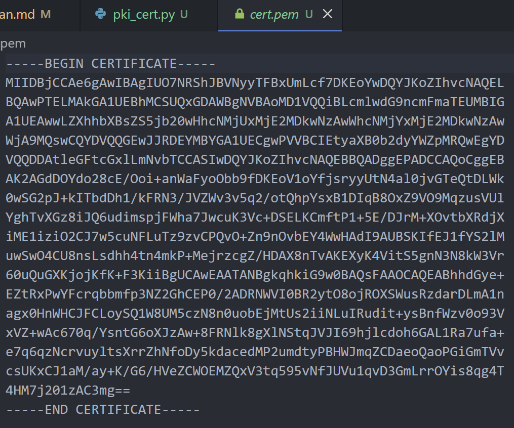

# Laporan Praktikum Kriptografi
Minggu ke-: 10  
Topik: Public Key Infrastructure (PKI & Certificate Authority)  
Nama: Nur Fatahillah 
NIM: 230202772  
Kelas: 5IKRB  

---

## 1. Tujuan
1. Membuat sertifikat digital sederhana.
2. Menjelaskan peran Certificate Authority (CA) dalam sistem PKI.
3. Mengevaluasi fungsi PKI dalam komunikasi aman (contoh: HTTPS, TLS).


---

## 2. Dasar Teori
Public Key Infrastructure (PKI) adalah kerangka kerja dalam kriptografi yang digunakan untuk mengelola, mendistribusikan, dan memverifikasi kunci publik agar komunikasi digital dapat berlangsung secara aman. PKI memanfaatkan kriptografi kunci publik (asimetris) dengan sepasang kunci, yaitu kunci publik dan kunci privat, untuk menjamin keamanan seperti kerahasiaan, integritas data, autentikasi, dan nirsangkal. Di dalam PKI terdapat komponen penting seperti sertifikat digital, kebijakan keamanan, serta mekanisme penerbitan dan pencabutan sertifikat.

Certificate Authority (CA) merupakan pihak tepercaya dalam sistem PKI yang berperan menerbitkan, memverifikasi, dan menandatangani sertifikat digital. CA memastikan bahwa identitas pemilik kunci publik sesuai dengan informasi yang tercantum dalam sertifikat, sehingga pengguna dapat mempercayai keaslian kunci publik tersebut. Dengan adanya CA, komunikasi dan transaksi digital seperti pada HTTPS, tanda tangan digital, dan email aman—dapat dilakukan dengan tingkat kepercayaan dan keamanan yang tinggi.

---

## 3. Alat dan Bahan
- Python 3.x  
- Visual Studio Code / editor lain  
- Git dan akun GitHub  
- Library tambahan cryptography pyopenssl

---

## 4. Langkah Percobaan
1. Membuat file `pki_cert.py` di folder `praktikum/week10-pki/src/`.
2. Menyalin kode program dari panduan praktikum.
3. Menjalankan program dengan perintah `pki_cert.py`.

---

## 5. Source Code
```python
from cryptography import x509
from cryptography.x509.oid import NameOID
from cryptography.hazmat.primitives import hashes, serialization
from cryptography.hazmat.primitives.asymmetric import rsa
from datetime import datetime, timedelta

# Generate key pair
key = rsa.generate_private_key(public_exponent=65537, key_size=2048)

# Buat subject & issuer (CA sederhana = self-signed)
subject = issuer = x509.Name([
    x509.NameAttribute(NameOID.COUNTRY_NAME, u"ID"),
    x509.NameAttribute(NameOID.ORGANIZATION_NAME, u"UPB Kriptografi"),
    x509.NameAttribute(NameOID.COMMON_NAME, u"example.com"),
])

# Buat sertifikat
cert = (
    x509.CertificateBuilder()
    .subject_name(subject)
    .issuer_name(issuer)
    .public_key(key.public_key())
    .serial_number(x509.random_serial_number())
    .not_valid_before(datetime.utcnow())
    .not_valid_after(datetime.utcnow() + timedelta(days=365))
    .sign(key, hashes.SHA256())
)

# Simpan sertifikat
with open("cert.pem", "wb") as f:
    f.write(cert.public_bytes(serialization.Encoding.PEM))

print("Sertifikat digital berhasil dibuat: cert.pem")
```

---

## 6. Hasil dan Pembahasan


---

## 7. Jawaban Pertanyaan 
- Pertanyaan 1: Fungsi utama Certificate Authority (CA) adalah memverifikasi identitas entitas (server, organisasi, atau individu) dan menerbitkan sertifikat digital yang mengikat identitas tersebut dengan kunci publiknya. CA bertindak sebagai pihak tepercaya yang menandatangani sertifikat secara kriptografis, sehingga pengguna lain dapat memastikan keaslian identitas, validitas kunci publik, serta menjamin autentikasi dan kepercayaan dalam komunikasi digital.  
- Pertanyaan 2: Self-signed certificate tidak cukup untuk sistem produksi karena sertifikat tersebut tidak diverifikasi oleh pihak ketiga yang tepercaya. Akibatnya, klien atau browser tidak dapat memastikan keaslian identitas pemilik sertifikat dan akan menampilkan peringatan keamanan. Kondisi ini membuka peluang serangan seperti impersonation dan menurunkan tingkat kepercayaan pengguna, sehingga tidak sesuai untuk lingkungan produksi yang membutuhkan keamanan dan keandalan tinggi.  
- Pertanyaan 3: PKI mencegah serangan Man-In-The-Middle (MITM) dalam komunikasi TLS/HTTPS dengan menggunakan sertifikat digital yang diterbitkan dan ditandatangani oleh CA tepercaya. Saat koneksi dibuat, klien memverifikasi sertifikat server dengan memeriksa tanda tangan CA, masa berlaku, dan kesesuaian domain. Jika sertifikat valid, klien dapat memastikan bahwa kunci publik benar-benar milik server yang sah, sehingga penyerang tidak dapat menyamar atau menyisipkan diri di tengah komunikasi tanpa terdeteksi.  

---

## 8. Kesimpulan
Dapat disimpulkan bahwa Public Key Infrastructure (PKI) merupakan fondasi utama dalam menjaga keamanan komunikasi digital melalui pengelolaan kunci publik dan sertifikat digital. Certificate Authority (CA) berperan penting sebagai pihak tepercaya yang memverifikasi identitas dan menjamin keaslian kunci publik, sehingga komunikasi dapat berlangsung dengan aman dan terpercaya. Penggunaan sertifikat yang diterbitkan CA juga menjadi kunci dalam mencegah ancaman keamanan seperti serangan Man-In-The-Middle (MITM), sedangkan penggunaan self-signed certificate tidak memadai untuk sistem produksi karena rendahnya tingkat kepercayaan. Oleh karena itu, PKI dan CA menjadi komponen krusial dalam penerapan keamanan pada layanan digital seperti TLS/HTTPS.
---

## 9. Daftar Pustaka
---

## 10. Commit Log
```
week10-pki
Author: Nur Fatahillah <dneth001@gmail.com>
Date:   2025-12-16

    week10-pki: Public Key Infrastructure (PKI & Certificate Authority)
```
