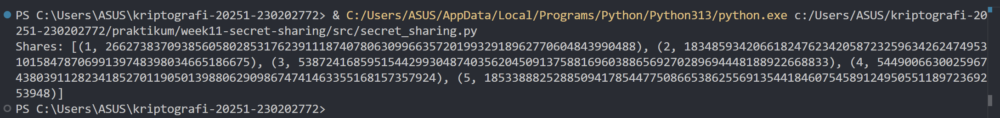

# Laporan Praktikum Kriptografi
Minggu ke-: 11  
Topik: Secret Sharing (Shamir's Secret Sharing)  
Nama: Nur Fatahillah  
NIM: 230202772  
Kelas: 5IKRB  

---

## 1. Tujuan
Menjelaskan konsep Shamir Secret Sharing (SSS).
Melakukan simulasi pembagian rahasia ke beberapa pihak menggunakan skema SSS.
Menganalisis keamanan skema distribusi rahasia.


---

## 2. Dasar Teori
Secret Sharing merupakan teknik dalam kriptografi yang digunakan untuk membagi sebuah informasi rahasia (secret) menjadi beberapa bagian (shares) yang didistribusikan kepada sejumlah pihak. Tujuan utama dari metode ini adalah meningkatkan keamanan dan keandalan penyimpanan data, sehingga rahasia tersebut tidak dapat diketahui hanya oleh satu pihak saja. Rahasia baru dapat direkonstruksi kembali apabila sejumlah minimum bagian tertentu dikumpulkan sesuai dengan ketentuan yang telah ditetapkan.

Shamir’s Secret Sharing (SSS) adalah salah satu skema secret sharing yang diperkenalkan oleh Adi Shamir pada tahun 1979 dan berbasis pada konsep matematika interpolasi polinomial. Dalam skema ini, sebuah rahasia direpresentasikan sebagai konstanta dari suatu polinom berderajat k−1, kemudian dibangkitkan sejumlah nilai polinom tersebut sebagai shares yang dibagikan kepada peserta. Rahasia hanya dapat dipulihkan apabila minimal k buah shares digabungkan, sedangkan kurang dari 𝑘 shares tidak memberikan informasi apa pun tentang rahasia. Skema ini banyak digunakan dalam sistem keamanan, manajemen kunci kriptografi, dan perlindungan data sensitif.

---

## 3. Alat dan Bahan
- Python 3.x  
- Visual Studio Code / editor lain  
- Git dan akun GitHub
- pip install secretsharing   

---

## 4. Langkah Percobaan

1. Menginstall secretsharing pada terminal.
2. Membuat file `secret_sharing.py` pada folder `src`.
3. Menyalin kode program dari panduan praktikum.
4. Menjalankan program dengan perintah `secret_sharing.py`.

---

## 5. Source Code

```python
import random

# Modulo prima
P = 208351617316091241234326746312124448251235562226470491514186331217050270460481

def polynom(x, coefficients):
    result = 0
    for i, coef in enumerate(coefficients):
        result = (result + coef * pow(x, i, P)) % P
    return result

def split_secret(secret, k, n):
    coefficients = [secret] + [random.randint(1, P-1) for _ in range(k-1)]
    shares = [(x, polynom(x, coefficients)) for x in range(1, n+1)]
    return shares

# Contoh penggunaan
secret = 1234
shares = split_secret(secret, 3, 5)
print("Shares:", shares)

```


---

## 6. Hasil dan Pembahasan

- Disini saya menggunakan Simulasi Manual (Tanpa Library) yang dimana hasilnya adalah seperti ini 




---

## 7. Jawaban Pertanyaan
- Pertanyaan 1: Keuntungan utama Shamir Secret Sharing adalah peningkatan keamanan karena rahasia tidak pernah disimpan atau dibagikan secara utuh kepada satu pihak pun. Setiap pihak hanya memegang sebagian informasi (share) yang secara individual tidak memiliki makna. Berbeda dengan pembagian salinan kunci langsung, kebocoran satu atau beberapa share tidak menyebabkan rahasia terungkap, sehingga risiko pencurian atau penyalahgunaan kunci dapat diminimalkan.  
- Pertanyaan 2: Threshold (k) menentukan jumlah minimum share yang diperlukan untuk merekonstruksi rahasia. Nilai k berperan penting dalam menyeimbangkan keamanan dan ketersediaan sistem. Semakin besar nilai k, semakin tinggi tingkat keamanan karena lebih banyak pihak harus bekerja sama, namun semakin kecil toleransi terhadap kehilangan share. Sebaliknya, nilai k yang terlalu kecil dapat mengurangi keamanan karena rahasia lebih mudah direkonstruksi oleh pihak yang tidak berwenang.  
- Pertanyaan 3: Salah satu contoh penerapan nyata Shamir Secret Sharing adalah pada manajemen kunci dompet cryptocurrency. Kunci privat dibagi menjadi beberapa share dan didistribusikan kepada pihak berbeda (misalnya pemilik, notaris, dan anggota keluarga). Dengan cara ini, kunci privat hanya dapat dipulihkan jika sejumlah pihak tertentu bekerja sama, sehingga mengurangi risiko kehilangan aset akibat peretasan atau kehilangan satu kunci tunggal.  

---

## 8. Kesimpulan
Simulasi algoritma Shamir’s Secret Sharing (SSS) menggunakan bahasa pemrograman Python berhasil membuktikan bahwa keamanan informasi dapat ditingkatkan secara signifikan dengan memecah satu rahasia menjadi beberapa bagian (shares) yang terdistribusi. Metode ini memastikan bahwa rahasia utuh tidak dimiliki oleh satu pihak saja, melainkan membutuhkan penggabungan sejumlah bagian minimum (threshold) sesuai ketentuan matematika untuk dapat dipulihkan kembali. Dengan demikian, skema ini terbukti efektif dalam meminimalkan risiko kegagalan tunggal (single point of failure) dan mencegah penyalahgunaan akses, menjadikannya solusi yang sangat relevan untuk diterapkan pada sistem keamanan tinggi seperti manajemen kunci kriptografi maupun perlindungan aset digital.

---

## 9. Daftar Pustaka

---

## 10. Commit Log

```
week11-secret-sharing
Author: Nur Fatahillah <dneth001@gmail.com>
Date:   2026-01-25

    week11-secret-sharing: Secret Sharing (Shamir’s Secret Sharing) 
```
