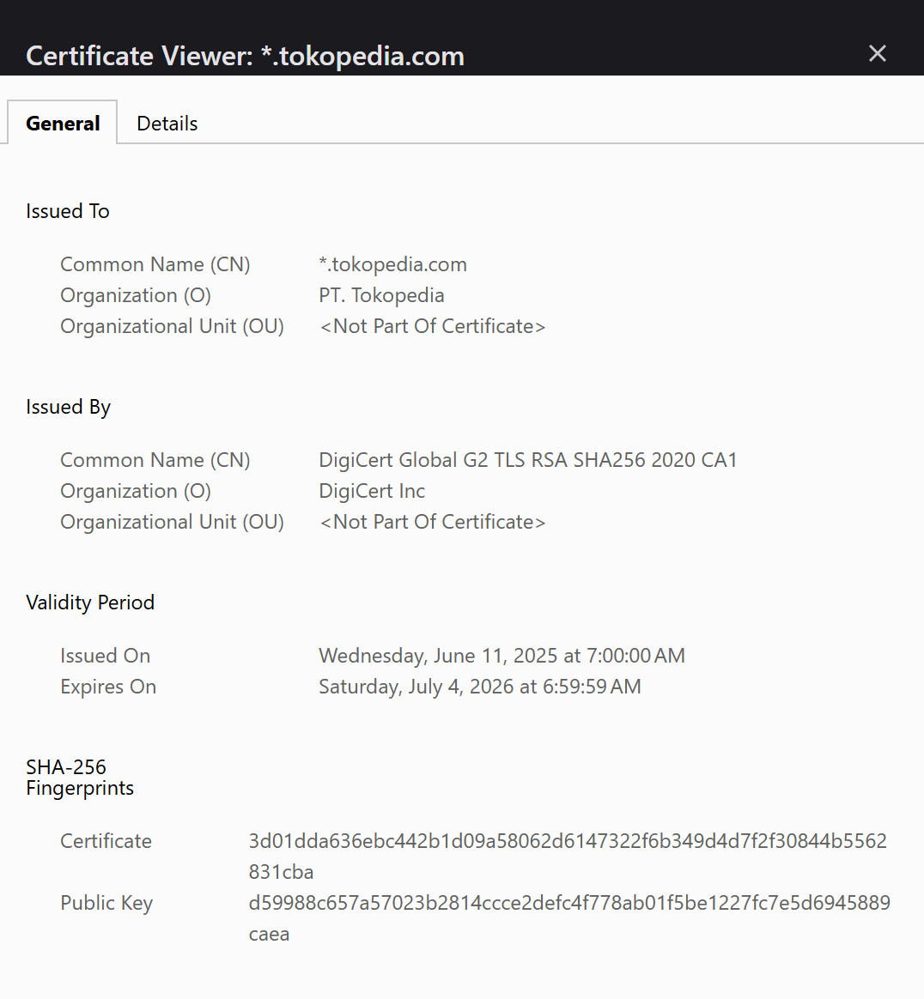

# Laporan Praktikum Kriptografi
Minggu ke-: 12  
Topik: Aplikasi TLS & E-commerce  
Nama: Nur Fatahillah  
NIM: 230202772  
Kelas: 5IKRB  

---

## 1. Tujuan
Menganalisis penggunaan kriptografi pada email dan SSL/TLS.
Menjelaskan enkripsi dalam transaksi e-commerce.
Mengevaluasi isu etika & privasi dalam penggunaan kriptografi di kehidupan sehari-hari.

---

## 2. Dasar Teori
Transport Layer Security (TLS) merupakan protokol kriptografi yang digunakan untuk mengamankan komunikasi data melalui jaringan komputer, khususnya internet. TLS bekerja dengan menyediakan tiga aspek utama keamanan, yaitu kerahasiaan (confidentiality), keutuhan data (integrity), dan autentikasi (authentication). Protokol ini menggunakan kombinasi kriptografi kunci publik dan kunci simetris, di mana kunci publik digunakan pada tahap awal untuk proses handshake dan pertukaran kunci, sedangkan kunci simetris digunakan untuk mengenkripsi data selama sesi komunikasi berlangsung agar proses lebih efisien dan aman.

Dalam konteks e-commerce, TLS berperan sangat penting dalam melindungi transaksi elektronik antara pengguna dan server, seperti pengiriman data login, informasi kartu pembayaran, dan detail transaksi. Dengan adanya TLS, data yang dikirimkan menjadi terenkripsi sehingga tidak dapat dibaca atau dimanipulasi oleh pihak yang tidak berwenang. Selain itu, penggunaan sertifikat digital pada TLS memungkinkan pengguna memverifikasi keaslian server e-commerce, sehingga meningkatkan kepercayaan pelanggan dan mencegah serangan seperti man-in-the-middle. Oleh karena itu, TLS menjadi fondasi utama keamanan pada sistem e-commerce modern.

---

## 3. Alat dan Bahan
- Python 3.x  
- Visual Studio Code / editor lain  
- Git dan akun GitHub  


---

## 4. Langkah Percobaan
1. Mengecek sertifikat pada salah satu apl e-commerce, disini saya menggunakan tokopedia
2. Analisis etika dan privasi

---

## 5. Source Code

---

## 6. Hasil dan Pembahasan
- Saya menggunakan website tokopedia dalam analisis ini
- Issuer CA pada digicert global g2 CN = DigiCert Global Root G2
OU = www.digicert.com
O = DigiCert Inc
C = US
- Masa berlaku yaitu sampai Saturday, July 4, 2026 at 6:59:59 AM
- Hash SHA nya d59988c657a57023b2814ccce2defc4f778ab01f5be1227fc7e5d6945889caea
- Analisis penggunaan enkripsi
    Pada sistem e-commerce, TLS digunakan untuk mengenkripsi data pengguna selama proses login dan transaksi pembayaran sehingga informasi sensitif tidak dapat diakses oleh pihak yang tidak berwenang.
- Ancaman Jika TLS Tidak Digunakan
    Tanpa TLS, penyerang dapat menyadap komunikasi antara pengguna dan server melalui serangan Man-in-the-Middle, yang berpotensi mencuri data login dan informasi pembayaran.
- Privasi Email Terenkripsi
    Enkripsi email menggunakan PGP atau S/MIME bertujuan untuk menjaga kerahasiaan isi pesan agar tidak dapat dibaca oleh pihak lain.
- Apakah perusahaan boleh mendekripsi email karyawan?
    Secara etika, perusahaan dapat melakukan audit dengan batasan tertentu, namun harus disertai kebijakan yang jelas dan persetujuan karyawan untuk menjaga privasi.
- Pengawasan pemerintah terhadap komunikasi terenkripsi
    Pengawasan diperlukan untuk keamanan nasional, namun harus diimbangi dengan perlindungan hak privasi masyarakat agar tidak terjadi penyalahgunaan wewenang.


---

## 7. Jawaban Pertanyaan  
- Pertanyaan 1: Perbedaan utama antara HTTP dan HTTPS terletak pada aspek keamanan komunikasi data. HTTP (Hypertext Transfer Protocol) mengirimkan data dalam bentuk teks biasa (plaintext) sehingga mudah disadap atau dimodifikasi oleh pihak ketiga. Sementara itu, HTTPS (Hypertext Transfer Protocol Secure) menggunakan protokol TLS untuk mengenkripsi data yang dikirimkan antara klien dan server. Dengan adanya enkripsi ini, HTTPS menjamin kerahasiaan, keutuhan data, serta autentikasi server, sehingga komunikasi menjadi lebih aman dibandingkan HTTP.  
- Pertanyaan 2: Sertifikat digital berperan penting dalam komunikasi TLS karena digunakan untuk memverifikasi identitas server yang diakses oleh pengguna. Sertifikat ini diterbitkan oleh Certificate Authority (CA) tepercaya dan berisi informasi kunci publik server. Dengan adanya sertifikat digital, pengguna dapat memastikan bahwa mereka benar-benar terhubung ke server yang sah, bukan server palsu milik penyerang. Hal ini mencegah terjadinya serangan seperti Man-in-the-Middle dan membangun kepercayaan dalam komunikasi digital.  
- Pertanyaan 3: Kriptografi mendukung privasi dalam komunikasi digital dengan cara mengenkripsi data sehingga hanya pihak yang berwenang yang dapat mengakses informasi tersebut. Teknologi ini melindungi data pribadi, komunikasi, dan transaksi dari penyadapan serta penyalahgunaan. Namun, di sisi lain, kriptografi juga menimbulkan tantangan hukum dan etika, terutama terkait pengawasan dan penegakan hukum. Enkripsi yang kuat dapat menyulitkan aparat dalam melakukan investigasi kejahatan digital, sehingga menimbulkan dilema antara perlindungan privasi individu dan kepentingan keamanan publik.  

---

## 8. Kesimpulan
Berdasarkan analisis yang telah dilakukan terhadap protokol keamanan pada e-commerce Tokopedia dan studi literatur mengenai TLS, dapat disimpulkan bahwa implementasi kriptografi melalui protokol HTTPS/TLS memegang peranan vital dalam menjamin keamanan ekosistem digital. Pengamatan pada sertifikat digital membuktikan bahwa mekanisme ini tidak hanya melindungi kerahasiaan data sensitif pengguna—seperti informasi login dan pembayaran—melalui enkripsi yang kuat, tetapi juga memvalidasi otentikasi server untuk mencegah serangan Man-in-the-Middle. Lebih jauh lagi, selain aspek teknis, penerapan kriptografi menghadirkan tantangan etika dan privasi yang kompleks; meskipun enkripsi mutlak diperlukan untuk melindungi hak privasi individu dalam komunikasi (seperti email), penggunaannya harus diimbangi dengan kebijakan yang transparan terkait wewenang audit perusahaan maupun pengawasan pemerintah demi menjaga keseimbangan antara kebebasan pribadi dan keamanan nasional.

---

## 9. Daftar Pustaka

---

## 10. Commit Log
```
week12-aplikasi-tls
Author: Nur Fatahillah <dneth001@gmail.com>
Date:   2026-01-25

    week12-aplikasi-tls: Aplikasi TLS & E-commerce
```
