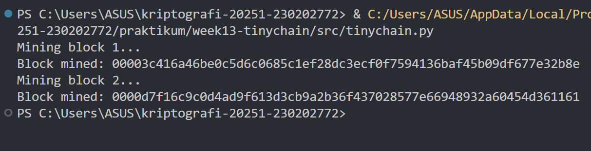

# Laporan Praktikum Kriptografi
Minggu ke-: 13  
Topik: TinyChain – Proof of Work (PoW)  
Nama: Nur Fatahillah  
NIM: 230202772  
Kelas: 5IKRB  

---

## 1. Tujuan
- Menjelaskan peran hash function dalam blockchain.
- Melakukan simulasi sederhana Proof of Work (PoW).
- Menganalisis keamanan cryptocurrency berbasis kriptografi.

---

## 2. Dasar Teori
TinyChain merupakan sebuah implementasi sederhana dari teknologi blockchain yang digunakan sebagai media pembelajaran untuk memahami konsep dasar sistem terdistribusi dan kriptografi. Dalam TinyChain, data transaksi disimpan dalam bentuk blok yang saling terhubung melalui nilai hash, sehingga membentuk sebuah rantai (chain). Setiap blok berisi informasi transaksi, hash dari blok sebelumnya, serta nilai nonce yang berfungsi sebagai bagian dari mekanisme keamanan. Dengan struktur ini, perubahan data pada satu blok akan memengaruhi blok-blok berikutnya, sehingga menjaga integritas data dalam sistem.

Proof of Work (PoW) adalah mekanisme konsensus kriptografi yang digunakan dalam TinyChain untuk memvalidasi dan menambahkan blok baru ke dalam blockchain. PoW mengharuskan penambang (miner) untuk menyelesaikan permasalahan komputasi berupa pencarian nilai nonce yang menghasilkan hash sesuai dengan tingkat kesulitan tertentu. Proses ini membutuhkan sumber daya komputasi yang signifikan, sehingga mencegah manipulasi data dan serangan oleh pihak yang tidak bertanggung jawab. Melalui penerapan PoW pada TinyChain, konsep keamanan blockchain seperti integritas data, desentralisasi, dan ketahanan terhadap pemalsuan dapat dipahami secara lebih sederhana dan terstruktur.

---

## 3. Alat dan Bahan
- Python 3.x  
- Visual Studio Code / editor lain  
- Git dan akun GitHub  

---

## 4. Langkah Percobaan
1. Membuat file `tinychain.py` di folder `src/`.
2. Menyalin kode program dari panduan praktikum.
3. Menjalankan program dengan perintah `tinychain.py`.

---

## 5. Source Code
```python
import hashlib
import time

class Block:
    def __init__(self, index, previous_hash, data, timestamp=None):
        self.index = index
        self.timestamp = timestamp or time.time()
        self.data = data
        self.previous_hash = previous_hash
        self.nonce = 0
        self.hash = self.calculate_hash()

    def calculate_hash(self):
        value = str(self.index) + str(self.timestamp) + str(self.data) + str(self.previous_hash) + str(self.nonce)
        return hashlib.sha256(value.encode()).hexdigest()

    def mine_block(self, difficulty):
        while self.hash[:difficulty] != "0" * difficulty:
            self.nonce += 1
            self.hash = self.calculate_hash()
        print(f"Block mined: {self.hash}")

class Blockchain:
    def __init__(self):
        self.chain = [self.create_genesis_block()]
        self.difficulty = 4

    def create_genesis_block(self):
        return Block(0, "0", "Genesis Block")

    def get_latest_block(self):
        return self.chain[-1]

    def add_block(self, new_block):
        new_block.previous_hash = self.get_latest_block().hash
        new_block.mine_block(self.difficulty)
        self.chain.append(new_block)

# Uji coba blockchain
my_chain = Blockchain()
print("Mining block 1...")
my_chain.add_block(Block(1, "", "Transaksi A → B: 10 Coin"))

print("Mining block 2...")
my_chain.add_block(Block(2, "", "Transaksi B → C: 5 Coin"))
```

---

## 6. Hasil dan Pembahasan
Hasil eksekusi program Tiny chain:



---

## 7. Jawaban Pertanyaan  
- Pertanyaan 1: Fungsi hash sangat penting dalam blockchain karena berperan menjaga integritas dan keamanan data. Setiap blok dalam blockchain memiliki nilai hash unik yang dihasilkan dari data blok tersebut dan hash blok sebelumnya. Jika terjadi perubahan sekecil apa pun pada data di dalam blok, nilai hash akan berubah secara signifikan. Hal ini membuat manipulasi data mudah terdeteksi dan memastikan bahwa seluruh blok dalam blockchain saling terhubung secara aman dan tidak dapat diubah tanpa diketahui oleh jaringan.  
- Pertanyaan 2: Proof of Work mencegah double spending dengan cara memastikan bahwa setiap transaksi hanya dapat dicatat satu kali dalam blockchain melalui proses validasi dan konsensus jaringan. Untuk menambahkan blok baru, penambang harus menyelesaikan perhitungan kriptografi yang memerlukan waktu dan sumber daya komputasi. Ketika sebuah transaksi telah masuk ke dalam blok yang valid dan dikonfirmasi oleh mayoritas jaringan, transaksi tersebut dianggap sah dan tidak dapat digunakan kembali. Upaya untuk memalsukan atau menggandakan transaksi akan membutuhkan kekuatan komputasi yang sangat besar, sehingga secara praktis sulit dilakukan.  
- Pertanyaan 3: Kelemahan utama Proof of Work adalah konsumsi energi yang sangat tinggi karena proses penambangan membutuhkan komputasi intensif secara terus-menerus. Banyak penambang harus bersaing untuk memecahkan teka-teki kriptografi yang sama, sehingga sebagian besar energi yang digunakan tidak menghasilkan blok yang valid. Hal ini menyebabkan pemborosan energi, biaya operasional yang tinggi, serta dampak lingkungan yang signifikan, sehingga PoW dinilai kurang efisien dibandingkan mekanisme konsensus alternatif seperti Proof of Stake.  

---

## 8. Kesimpulan
Struktur dasar blockchain sangat bergantung pada fungsi hash kriptografis untuk menjamin integritas data. Simulasi menggunakan Python menunjukkan bahwa setiap blok saling terhubung melalui hash dari blok sebelumnya, sehingga manipulasi data pada satu blok akan merusak validitas seluruh rantai blok berikutnya. Selain itu, implementasi mekanisme Proof of Work (PoW) memperlihatkan bahwa keamanan jaringan diperoleh melalui komputasi yang intensif; penambang harus menemukan nilai nonce yang memenuhi tingkat kesulitan tertentu sebelum blok dapat divalidasi. Meskipun mekanisme ini terbukti efektif dalam mencegah serangan siber dan masalah double spending, praktikum ini juga mengonfirmasi bahwa PoW memiliki konsekuensi berupa konsumsi sumber daya komputasi dan energi yang signifikan.
---

## 9. Daftar Pustaka

---

## 10. Commit Log
```
week13-tinychain
Author: Nur Fatahillah <dneth001@gmail.com>
Date:   2026-01-25

    week13-tinychain: TinyChain – Proof of Work (PoW)
```
