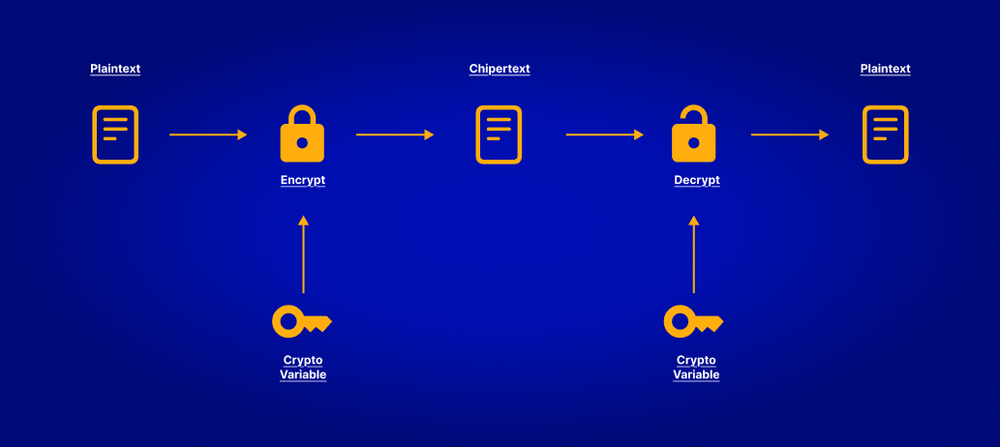
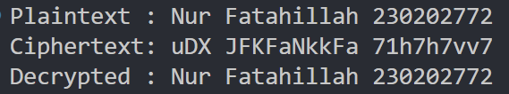

# Laporan Praktikum Kriptografi
Minggu ke-: 2  
Topik: Kripto Sistem
Nama: Nur Fatahillah
NIM: 230202772  
Kelas: 5IKRB 

---

## 1. Tujuan
1. Mengidentifikasi komponen dasar kriptosistem (plaintext, ciphertext, kunci, algoritma).
2. Menggambarkan proses enkripsi dan dekripsi sederhana.
3. Mengklasifikasikan jenis kriptosistem (simetris dan asimetris).


---

## 2. Dasar Teori
Komponen Kriptosistem

Kriptosistem adalah suatu sistem yang digunakan dalam kriptografi untuk menjaga keamanan data melalui proses enkripsi dan dekripsi. Dalam sebuah kriptosistem terdapat beberapa komponen utama yang saling berkaitan. Komponen pertama adalah plaintext, yaitu pesan atau data asli yang masih dapat dibaca sebelum disandikan. Komponen kedua adalah ciphertext, yakni hasil dari proses enkripsi yang berupa pesan tersandi dan tidak dapat dibaca tanpa kunci yang sesuai. Proses perubahan dari plaintext menjadi ciphertext dilakukan oleh algoritma enkripsi, yaitu prosedur matematis yang digunakan untuk menyembunyikan isi pesan. Sebaliknya, untuk mengembalikan ciphertext menjadi pesan semula digunakan algoritma dekripsi. Kedua proses ini bergantung pada kunci (key), yaitu nilai rahasia yang digunakan untuk mengontrol proses enkripsi dan dekripsi. Tanpa kunci yang tepat, pesan tidak dapat dikembalikan ke bentuk aslinya. Dengan demikian, kelima komponen tersebut plaintext, ciphertext, algoritma enkripsi, algoritma dekripsi, dan kunci bekerja sama untuk memastikan kerahasiaan, integritas, serta keaslian informasi dalam sistem komunikasi yang aman.


Klasifikasi Simetris & Asimetris

Kriptografi Simetris
Kriptografi simetris adalah metode enkripsi yang menggunakan satu kunci yang sama untuk proses enkripsi (mengubah data menjadi sandi) dan dekripsi (mengembalikan sandi menjadi data asli).
Artinya, pengirim dan penerima pesan harus memiliki kunci rahasia yang sama dan menjaganya agar tidak bocor.
Contoh algoritma Simetris :
- AES (Advanced Encryption Standard)
- DES (Data Encryption Standard)
- 3DES (Triple DES)
- Blowfish

Kriptografi Asimetris
Kriptografi asimetris menggunakan dua kunci berbeda tetapi saling berhubungan secara matematis:
- Kunci publik (public key) → digunakan untuk enkripsi
- Kunci privat (private key) → digunakan untuk dekripsi
Kunci publik dapat dibagikan kepada siapa pun, sedangkan kunci privat harus dijaga kerahasiaannya.
Contoh algoritma asimetris:
- RSA (Rivest–Shamir–Adleman)
- ECC (Elliptic Curve Cryptography)
- DSA (Digital Signature Algorithm)

---

## 3. Alat dan Bahan

- Visual Studio Code  
- Git dan akun GitHub  
- Figma

---

## 4. Langkah Percobaan
1. Membuat file `caesar_cipher.py` di folder `praktikum/week2-cryptosystem/src/`.
2. Menyalin kode program dari panduan praktikum.
3. Menjalankan program dengan perintah `python caesar_cipher.py`
4. Membuat diagram kriptosistem di figma
5. Membuat folder praktikum/week2-cryptosystem/ berisi laporan.md dan folder screenshots.
6. Menulis ringkasan materi singkat.
7. Menjawab quiz

---

## 5. Source Code
```python
import random

CHARSET = "ABCDEFGHIJKLMNOPQRSTUVWXYZabcdefghijklmnopqrstuvwxyz0123456789"

def generate_key(seed):
    """Membangkitkan kunci acak deterministik dari seed (key)"""
    random.seed(seed)
    shuffled = list(CHARSET)
    random.shuffle(shuffled)
    return ''.join(shuffled)

def encrypt(plaintext, key):
    enc_table = generate_key(key)
    result = ""
    for char in plaintext:
        if char in CHARSET:
            index = CHARSET.index(char)
            result += enc_table[index]
        else:
            result += char  # spasi & simbol tetap
    return result

def decrypt(ciphertext, key):
    enc_table = generate_key(key)
    result = ""
    for char in ciphertext:
        if char in enc_table:
            index = enc_table.index(char)
            result += CHARSET[index]
        else:
            result += char
    return result


if __name__ == "__main__":
    message = "Nur Fatahillah 230202772"
    key = 5

    enc = encrypt(message, key)
    dec = decrypt(enc, key)

    print("Plaintext :", message)
    print("Ciphertext:", enc)
    print("Decrypted :", dec)

```

---

## 6. Hasil dan Pembahasan



---

## 7. Jawaban Pertanyaan  
1. Komponen utama dalam kriptosistem
    
Komponen utama dalam sebuah kriptosistem terdiri dari lima bagian, yaitu:
- Plaintext – pesan asli yang masih bisa dibaca sebelum dienkripsi.
- Ciphertext – hasil dari proses enkripsi berupa pesan yang telah disandikan.
- Algoritma Enkripsi – prosedur atau metode matematis untuk mengubah plaintext menjadi ciphertext.
- Algoritma Dekripsi – proses kebalikan dari enkripsi yang mengembalikan ciphertext menjadi plaintext.
- Kunci (Key) – nilai rahasia yang digunakan untuk mengontrol proses enkripsi dan dekripsi agar hanya pihak berwenang yang dapat membaca pesan.

Kelima komponen ini bekerja bersama untuk menjaga kerahasiaan, integritas, dan keaslian data dalam suatu sistem keamanan informasi.

2. Kelebihan dan Kelemahan Sistem Simetris Dibandingkan Asimetris

Kelebihan kriptografi simetris:
- Proses enkripsi dan dekripsi lebih cepat, karena algoritmanya sederhana dan efisien.
- Membutuhkan sumber daya komputasi yang lebih kecil, sehingga cocok untuk data dalam jumlah besar.

Kelemahan kriptografi simetris:
- Distribusi kunci sulit dan berisiko, karena pengirim dan penerima harus memiliki kunci yang sama dan menjaganya agar tidak bocor.
- Tidak cocok untuk komunikasi jarak jauh atau banyak pihak, karena semakin banyak pengguna, semakin rumit pengelolaan kuncinya.
- Kurang aman dibandingkan sistem asimetris jika kunci berhasil disadap, maka seluruh komunikasi bisa dibaca.
  
3. Mengapa Distribusi Kunci Menjadi Masalah Utama dalam Kriptografi Simetris
Distribusi kunci menjadi masalah utama dalam kriptografi simetris karena sistem ini menggunakan satu kunci yang sama untuk enkripsi dan dekripsi. Artinya, kunci tersebut harus dibagikan terlebih dahulu kepada pihak penerima sebelum komunikasi dapat dilakukan. Proses pengiriman kunci ini berpotensi disadap oleh pihak ketiga, sehingga kerahasiaan pesan bisa terancam jika kunci bocor. Selain itu, dalam jaringan dengan banyak pengguna, jumlah kunci yang harus dikelola akan meningkat secara eksponensial, membuat sistem sulit diatur dan kurang efisien. Oleh karena itu, sistem asimetris sering digunakan untuk membantu menyebarkan kunci simetris secara aman dalam praktik modern (seperti pada protokol HTTPS).


---

## 8. Kesimpulan
Kriptosistem merupakan sistem yang berfungsi menjaga keamanan data melalui proses enkripsi dan dekripsi dengan lima komponen utama, yaitu plaintext, ciphertext, algoritma enkripsi, algoritma dekripsi, dan kunci. Kelima komponen tersebut bekerja sama untuk memastikan kerahasiaan, keaslian, serta integritas informasi. Berdasarkan jenisnya, kriptografi terbagi menjadi dua, yaitu kriptografi simetris dan asimetris. Kriptografi simetris menggunakan satu kunci yang sama untuk proses enkripsi dan dekripsi, sehingga lebih cepat namun memiliki kelemahan dalam distribusi kunci. Sementara itu, kriptografi asimetris menggunakan dua kunci berbeda, yaitu kunci publik untuk enkripsi dan kunci privat untuk dekripsi, yang lebih aman dalam pertukaran kunci meskipun prosesnya lebih lambat. Dalam penerapan modern, kedua jenis kriptografi ini sering digunakan secara bersamaan untuk menciptakan sistem keamanan data yang efisien dan kuat, seperti pada komunikasi internet yang menggunakan protokol HTTPS.

---

## 9. Daftar Pustaka

---

## 10. Commit Log

```
commit Week2
Author: Nur Fatahillah <dneth002@gmail.com>
Date:   2025-10-12

    week2-cryptosystem: implementasi Caesar Cipher dan laporan
```
