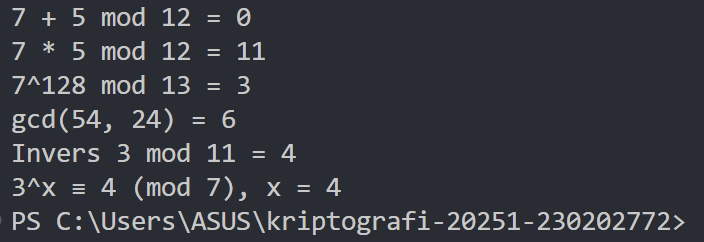

# Laporan Praktikum Kriptografi
Minggu ke-: 3  
Topik: modular math  
Nama: Nur Fatahillah  
NIM: 230202772  
Kelas: 5IKRB  

---

## 1. Tujuan
1. Menyelesaikan operasi aritmetika modular.  
2. Menentukan bilangan prima dan menghitung GCD (Greatest Common Divisor).  
3. Menerapkan logaritma diskrit sederhana dalam simulasi kriptografi. 

---

## 2. Dasar Teori

Arithmetic

Teori modular arithmetic** atau aritmetika modular** adalah cabang matematika yang mempelajari operasi bilangan seperti penjumlahan, pengurangan, dan perkalian dalam sistem yang nilainya berulang setelah mencapai batas tertentu yang disebut modulus. Dua bilangan dikatakan kongruen dalam modulus ( n ) jika selisihnya merupakan kelipatan dari ( n ), yang ditulis sebagai ( a \equiv b \pmod{n} ). Misalnya, ( 17 \equiv 5 \pmod{12} ) karena ( 17 - 5 = 12 ), dan 12 habis dibagi 12. Konsep ini mirip dengan sistem jam, di mana setelah angka 12, jam akan kembali ke 1. Contohnya, jika jam menunjukkan pukul 9 dan ditambah 5 jam, hasilnya menjadi jam 2 karena ( 9 + 5 \equiv 2 \pmod{12} ). Dalam aritmetika modular, operasi-operasi seperti penjumlahan, pengurangan, dan perkalian dilakukan dengan mengambil sisa hasil bagi terhadap modulus. Misalnya, ( (7 + 8) \mod 10 = 5 ), ( (3 - 9) \mod 7 = 1 ), dan ( (4 \times 6) \mod 5 = 4 ). Aritmetika modular banyak digunakan dalam berbagai bidang, seperti kriptografi (misalnya dalam algoritma RSA untuk keamanan data), pemrograman komputer untuk menghitung nilai berulang, sistem waktu dan kalender, serta dalam teori bilangan untuk mempelajari sifat-sifat bilangan prima dan kongruensi.

GCD

GCD (Greatest Common Divisor) atau FPB (Faktor Persekutuan Terbesar) adalah bilangan terbesar yang dapat membagi habis dua atau lebih bilangan. Contohnya, GCD(12, 18) = 6. Nilai GCD dapat dihitung menggunakan Algoritma Euclidean, yaitu dengan cara membagi dua bilangan secara berulang hingga sisa pembagiannya nol. GCD penting dalam penyederhanaan pecahan, teori bilangan, serta digunakan dalam aritmetika modular untuk mencari invers modular, yaitu bilangan yang memiliki pasangan tertentu dalam operasi modulo.


---

## 3. Alat dan Bahan
- Python 3.x  
- Visual Studio Code 
- Git dan akun GitHub  

---

## 4. Langkah Percobaan
1. Membuat file `modular_math.py` di folder `praktikum/week3-modmath/src/modular_math.py`.
2. Menyalin kode program dari panduan praktikum.
3. Menjalankan program dengan perintah `python modular_math.py`.
4. Screenshot hasil program dan di taruh ke dalam folder `praktikum/week3-modmath-gcd/screenshots/hasil.png`

---

## 5. Source Code
```python

def mod_add(a, b, n): return (a + b) % n
def mod_sub(a, b, n): return (a - b) % n
def mod_mul(a, b, n): return (a * b) % n
def mod_exp(base, exp, n): return pow(base, exp, n)  # eksponensiasi modular

print("7 + 5 mod 12 =", mod_add(7, 5, 12))
print("7 * 5 mod 12 =", mod_mul(7, 5, 12))
print("7^128 mod 13 =", mod_exp(7, 128, 13))

def gcd(a, b):
    while b != 0:
        a, b = b, a % b
    return a

print("gcd(54, 24) =", gcd(54, 24))

def egcd(a, b):
    if a == 0:
        return b, 0, 1
    g, x1, y1 = egcd(b % a, a)
    return g, y1 - (b // a) * x1, x1

def modinv(a, n):
    g, x, _ = egcd(a, n)
    if g != 1:
        return None
    return x % n

print("Invers 3 mod 11 =", modinv(3, 11))

def discrete_log(a, b, n):
    for x in range(n):
        if pow(a, x, n) == b:
            return x
    return None

print("3^x ≡ 4 (mod 7), x =", discrete_log(3, 4, 7))
```

---

## 6. Hasil dan Pembahasan



---

## 7. Jawaban Pertanyaan
Jawab pertanyaan diskusi yang diberikan pada modul.  
- Pertanyaan 1: Aritmetika modular memegang peranan krusial dalam kriptografi modern karena menjadi landasan bagi berbagai algoritma enkripsi, dekripsi, serta tanda tangan digital. Dalam sistem ini, setiap operasi matematika dilakukan dalam ruang bilangan dengan modulus tertentu, sehingga hasilnya selalu berupa sisa pembagian terhadap bilangan tersebut. Konsep ini memungkinkan terciptanya sistem keamanan yang sulit dipecahkan tanpa mengetahui kunci rahasia. Contohnya, pada algoritma RSA, tingkat keamanannya bergantung pada sulitnya memfaktorkan bilangan besar yang merupakan hasil perkalian dua bilangan prima, serta penggunaan operasi perpangkatan dan invers dalam modulo tertentu. Selain RSA, aritmetika modular juga diterapkan dalam protokol Diffie-Hellman, ElGamal, dan algoritma berbasis kurva eliptik (ECC). Karena efisiensi matematis dan kemampuannya menjaga kerahasiaan informasi, aritmetika modular menjadi pondasi utama bagi sistem keamanan komunikasi digital masa kini.
 
- Pertanyaan 2: Invers modular merupakan pilar matematis yang memungkinkan kriptografi kunci publik seperti RSA dapat berfungsi, karena ia menciptakan hubungan asimetris yang esensial antara kunci publik dan kunci privat. Secara spesifik, kunci privat d dihitung sebagai invers perkalian modular dari kunci publik e terhadap nilai phi φ(n)—sebuah nilai yang hanya bisa didapatkan jika faktor prima rahasia dari n (yaitu p dan q) diketahui. Hubungan matematis ini, yaitu (e * d) mod φ(n) = 1, memastikan bahwa pesan yang dienkripsi menggunakan kunci publik e hanya dapat didekripsi oleh kunci privat d yang bersesuaian. Keamanan sistem ini bergantung pada fakta bahwa meskipun sangat mudah untuk menghitung d jika φ(n) diketahui, namun sangat sulit secara komputasi bagi pihak luar untuk menemukan φ(n) hanya dari kunci publik (e dan n), karena hal itu memerlukan pemfaktoran n menjadi p dan q yang merupakan masalah komputasi yang sangat sulit. Dengan demikian, invers modular adalah mekanisme inti yang secara matematis mengikat pasangan kunci tersebut sekaligus menjadi dasar keamanannya.

- Pertanyaan 3:Tantangan utama dalam menyelesaikan logaritma diskrit untuk modulus besar terletak pada tidak adanya algoritma efisien yang mampu menyelesaikannya dalam waktu yang wajar pada komputer klasik. Masalah ini pada dasarnya adalah sebuah fungsi satu arah: sangat mudah dan cepat untuk menghitung hasil perpangkatan modular ($g^x \pmod{p}$), namun sangat sulit secara komputasi untuk mencari nilai x jika hanya hasil, basis, dan modulusnya yang diketahui. Ketika ukuran modulus p meningkat, ruang pencarian untuk nilai x tumbuh secara eksponensial, membuat metode seperti brute-force menjadi tidak mungkin secara praktis. Bahkan algoritma tercanggih yang ada saat ini, seperti Index Calculus, memiliki kompleksitas waktu sub-eksponensial yang masih terlalu lambat untuk memecahkan masalah ini pada ukuran kunci yang digunakan dalam kriptografi modern. Kesulitan fundamental inilah yang menjadi landasan keamanan bagi banyak sistem kriptografi kunci publik, seperti Diffie-Hellman dan DSA, yang keamanannya bergantung pada asumsi bahwa masalah logaritma diskrit ini tidak dapat dipecahkan.

---

## 8. Kesimpulan
Aritmetika modular merupakan fondasi utama dalam kriptografi modern karena menyediakan struktur matematis yang memungkinkan terciptanya sistem keamanan digital yang kuat dan efisien. Konsep invers modular memainkan peran penting dalam menjaga hubungan antara kunci publik dan kunci privat pada algoritma seperti RSA, memastikan hanya pihak yang berwenang yang dapat melakukan dekripsi atau penandatanganan digital. Sementara itu, kesulitan dalam menyelesaikan logaritma diskrit untuk modulus besar menjadi salah satu pilar keamanan utama bagi berbagai sistem kriptografi, karena hingga kini belum ditemukan metode komputasi yang efisien untuk memecahkannya. Dengan demikian, kombinasi dari aritmetika modular, invers modular, dan kompleksitas logaritma diskrit membentuk dasar matematis yang kokoh bagi keamanan komunikasi dan pertukaran data di era digital modern.

---

## 9. Daftar Pustaka

---

## 10. Commit Log
(Tuliskan bukti commit Git yang relevan.  
Contoh:
```
commit abc12345
Author: Nur Fatahillah <>dneth001@gmail.com
Date:   2025-10-17

    week3-modmath: (Aritmetika Modular, GCD, Bilangan Prima, Logaritma Diskrit) )
```
