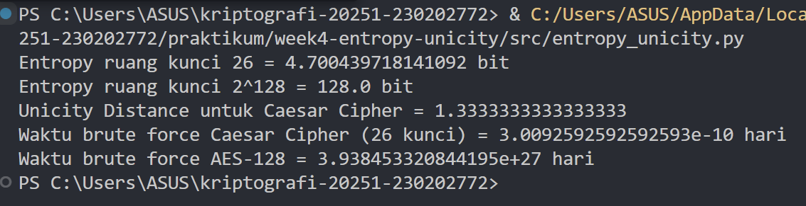

# Laporan Praktikum Kriptografi
Minggu ke-: 4
Topik: Entropy & Unicity Distance (Evaluasi Kekuatan Kunci dan Brute Force) 
Nama: Nur Fatahillah 
NIM: 230202772  
Kelas: 5IKRB

---

## 1. Tujuan
- Perhitungan manual/komputasi entropi dan unicity distance.
- Analisis sederhana model brute force attack.
- Laporan singkat tentang evaluasi kekuatan kunci.

---

## 2. Dasar Teori
Entropi dalam kriptografi merupakan ukuran tingkat ketidakpastian atau kerandoman dari suatu sistem, yang menunjukkan seberapa sulit suatu pesan atau kunci ditebak. Konsep ini berasal dari teori informasi Claude Shannon, di mana entropi dihitung berdasarkan probabilitas kemunculan simbol-simbol dalam pesan. Semakin tinggi nilai entropi, semakin acak dan aman sistem kriptografi tersebut, karena setiap kemungkinan kunci memiliki peluang yang sama untuk muncul. Sebaliknya, entropi rendah menandakan adanya pola yang mudah dikenali, sehingga cipher menjadi rentan terhadap serangan.

Sementara itu, unicity distance atau jarak keunikan adalah jumlah minimum ciphertext yang dibutuhkan agar suatu sistem enkripsi dapat dipecahkan secara unik tanpa ambiguitas. Rumusnya adalah ( U = \frac{H(K)}{D} ), di mana ( H(K) ) adalah entropi kunci dan ( D ) adalah redundansi bahasa. Nilai unicity distance menunjukkan seberapa banyak ciphertext yang diperlukan agar hanya ada satu kemungkinan plaintext yang masuk akal. Jika ciphertext yang tersedia lebih sedikit dari nilai ini, cipher masih tergolong aman karena banyak kemungkinan plaintext masih bisa cocok.

Kedua konsep ini saling berkaitan erat: entropi mengukur tingkat kerandoman kunci, sementara unicity distance mengukur jumlah data yang dibutuhkan untuk menebak kunci tersebut secara unik. Semakin tinggi entropi kunci, maka semakin besar nilai unicity distance, yang berarti semakin sulit bagi penyerang untuk memecahkan cipher meskipun telah memiliki banyak ciphertext.


---

## 3. Alat dan Bahan
- Python  
- Visual Studio Code / editor lain  
- Git dan akun GitHub  

---

## 4. Langkah Percobaan
1. Membuat file `entropy_unicity.py` di folder `praktikum/week4-entropy-unicity/src/entropy_unicity.py`.
2. Menyalin kode program dari panduan praktikum.
3. Menjalankan program dengan perintah `python caesar_cipher.py`.
4. Screenshot hasil dari program dan memasukan ke dalam folder screenshots `praktikum/week4-entropy-unicity/screenshots/hasil.png`

---

## 5. Source Code
```python
import math

def entropy(keyspace_size):
    return math.log2(keyspace_size)

print("Entropy ruang kunci 26 =", entropy(26), "bit")
print("Entropy ruang kunci 2^128 =", entropy(2**128), "bit")

def unicity_distance(HK, R=0.75, A=26):
    return HK / (R * math.log2(A))

HK = entropy(26)
print("Unicity Distance untuk Caesar Cipher =", unicity_distance(HK))

def brute_force_time(keyspace_size, attempts_per_second=1e6):
    seconds = keyspace_size / attempts_per_second
    days = seconds / (3600*24)
    return days

print("Waktu brute force Caesar Cipher (26 kunci) =", brute_force_time(26), "hari")
print("Waktu brute force AES-128 =", brute_force_time(2**128), "hari")
```

---

## 6. Hasil dan Pembahasan


---

## 7. Jawaban Pertanyaan
  
- Pertanyaan 1: Nilai entropi dalam konteks kekuatan kunci menunjukkan tingkat kerandoman atau ketidakpastian dari kunci yang digunakan dalam sistem kriptografi. Semakin tinggi entropinya, semakin besar jumlah kemungkinan kunci yang bisa digunakan, sehingga semakin sulit bagi penyerang untuk menebak atau menelusuri kunci yang benar. Dengan kata lain, entropi yang tinggi berarti kunci tersebut lebih kuat dan lebih tahan terhadap serangan seperti brute force atau analisis statistik. Sebaliknya, entropi yang rendah menandakan bahwa kunci memiliki pola atau prediktabilitas tertentu, sehingga lebih mudah diserang.  
- Pertanyaan 2: Unicity distance penting karena menunjukkan berapa banyak ciphertext yang dibutuhkan agar cipher dapat dipecahkan secara unik dan pasti oleh penyerang. Jika jumlah ciphertext yang tersedia masih lebih sedikit dari unicity distance, maka cipher masih aman karena banyak kemungkinan plaintext yang masih masuk akal. Namun jika ciphertext melebihi nilai unicity distance, penyerang dapat mulai membedakan plaintext yang benar dari yang salah berdasarkan redundansi atau pola bahasa yang muncul. Jadi, semakin besar nilai unicity distance, semakin kuat cipher tersebut, karena dibutuhkan lebih banyak data untuk memecahkannya secara unik.
- Pertanyaan 3: Brute force masih menjadi ancaman karena metode ini tidak bergantung pada kelemahan algoritma, melainkan mencoba semua kemungkinan kunci hingga menemukan yang benar. Meskipun algoritma enkripsi modern seperti AES atau RSA dirancang sangat kuat secara matematis, jika panjang kunci yang digunakan tidak cukup besar atau jika sistem implementasinya lemah (misalnya kunci mudah ditebak, tidak diacak dengan benar, atau ada kebocoran informasi), brute force tetap bisa berhasil. Selain itu, perkembangan teknologi komputasi — terutama komputasi paralel dan komputasi kuantum — dapat mempercepat proses brute force, sehingga ancaman ini tetap relevan dan harus diantisipasi dengan menjaga panjang kunci dan kualitas acaknya.  

---

## 8. Kesimpulan
Entropi dalam kriptografi adalah ukuran tingkat kerandoman atau ketidakpastian suatu kunci, yang menentukan seberapa sulit kunci tersebut ditebak. Semakin tinggi entropinya, semakin aman sistem karena kunci lebih acak dan sulit diprediksi. Sementara itu, unicity distance menunjukkan jumlah minimum ciphertext yang diperlukan agar suatu cipher dapat dipecahkan secara unik; semakin besar nilainya, semakin kuat keamanan cipher karena dibutuhkan lebih banyak data untuk menemukan kunci yang benar. Kedua konsep ini saling berkaitan entropi yang tinggi meningkatkan unicity distance dan memperkuat sistem enkripsi. Meskipun begitu, brute force tetap menjadi ancaman karena metode ini mencoba semua kemungkinan kunci tanpa memanfaatkan kelemahan algoritma. Perkembangan teknologi komputasi membuat brute force semakin cepat, sehingga penting untuk menggunakan kunci yang panjang dan acak agar sistem tetap aman.


---

## 9. Daftar Pustaka

---

## 10. Commit Log  
```
commit abc12345
Author: Nur Fatahillah <dneth001@gmail.com>
Date:   2025-10-26

    week4-entropy-unicity: Evaluasi Kekuatan Kunci dan Brute Force
```
