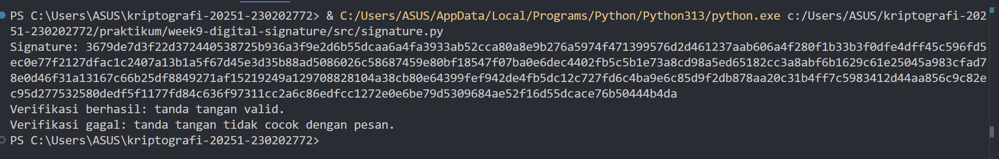

# Laporan Praktikum Kriptografi
Minggu ke-: 9  
Topik: Digital Signature (RSA/DSA)  
Nama: Nur Fatahillah  
NIM: 230202772  
Kelas: 5IKRB  

---

## 1. Tujuan
1. Mengimplementasikan tanda tangan digital menggunakan algoritma RSA/DSA.
2. Memverifikasi keaslian tanda tangan digital.
3. Menjelaskan manfaat tanda tangan digital dalam otentikasi pesan dan integritas data.


---

## 2. Dasar Teori
Tanda tangan digital merupakan mekanisme kriptografi yang berfungsi untuk menjamin keaslian pengirim, keutuhan data, serta nirsangkal pada dokumen atau pesan digital, sehingga berperan sebagai padanan tanda tangan manual di dunia elektronik. Prosesnya diawali dengan pengirim yang membuat ringkasan pesan menggunakan fungsi hash seperti SHA-256, kemudian ringkasan tersebut dienkripsi menggunakan kunci privat miliknya dengan algoritma kriptografi kunci publik seperti RSA atau DSA untuk menghasilkan tanda tangan digital yang dilampirkan pada dokumen asli. Pada tahap verifikasi, penerima mendekripsi tanda tangan menggunakan kunci publik pengirim untuk memperoleh ringkasan pesan, lalu membandingkannya dengan hasil perhitungan hash ulang dari dokumen yang diterima. Jika kedua nilai tersebut sama, maka dokumen terbukti berasal dari pengirim yang sah, tidak mengalami perubahan, dan pengirim tidak dapat menyangkal telah mengirimkannya, karena hanya pemilik kunci privat yang dapat menghasilkan tanda tangan tersebut.

---

## 3. Alat dan Bahan
- Python 3.x  
- Visual Studio Code / editor lain  
- Git dan akun GitHub   

---

## 4. Langkah Percobaan
1. Membuat file `signature.py` di folder `praktikum/week9-digital-signature/src/`.
2. Menyalin kode program dari panduan praktikum.
3. Menjalankan program dengan perintah `python signature.py`.

---

## 5. Source Code

```python
from Crypto.PublicKey import RSA
from Crypto.Signature import pkcs1_15
from Crypto.Hash import SHA256

# Generate pasangan kunci RSA
key = RSA.generate(2048)
private_key = key
public_key = key.publickey()

# Pesan yang akan ditandatangani
message = b"Hello, ini pesan penting."
h = SHA256.new(message)

# Buat tanda tangan dengan private key
signature = pkcs1_15.new(private_key).sign(h)
print("Signature:", signature.hex())

try:
    pkcs1_15.new(public_key).verify(h, signature)
    print("Verifikasi berhasil: tanda tangan valid.")
except (ValueError, TypeError):
    print("Verifikasi gagal: tanda tangan tidak valid.")

# Modifikasi pesan
fake_message = b"Hello, ini pesan palsu."
h_fake = SHA256.new(fake_message)

try:
    pkcs1_15.new(public_key).verify(h_fake, signature)
    print("Verifikasi berhasil (seharusnya gagal).")
except (ValueError, TypeError):
    print("Verifikasi gagal: tanda tangan tidak cocok dengan pesan.")
```

---

## 6. Hasil dan Pembahasan

---

## 7. Jawaban Pertanyaan
- Pertanyaan 1: Perbedaan utama terletak pada tujuan dan arah penggunaan kunci, di mana enkripsi RSA digunakan untuk menjaga kerahasiaan pesan dengan mengenkripsi data menggunakan kunci publik penerima dan mendekripsinya dengan kunci privat penerima, sedangkan tanda tangan digital RSA digunakan untuk menjamin keaslian, integritas, dan nirsangkal pesan dengan cara mengenkripsi ringkasan pesan (hash) menggunakan kunci privat pengirim dan memverifikasinya menggunakan kunci publik pengirim.  
- Pertanyaan 2: Tanda tangan digital menjamin integritas karena pesan yang telah diubah sekecil apa pun akan menghasilkan nilai hash yang berbeda sehingga proses verifikasi gagal, serta menjamin otentikasi karena hanya pemilik kunci privat yang sah yang dapat menghasilkan tanda tangan digital tersebut, sehingga identitas pengirim dapat dipastikan.  
- Pertanyaan 3: Certificate Authority (CA) berperan sebagai pihak tepercaya yang memverifikasi identitas pemilik kunci publik dan menerbitkan sertifikat digital yang menghubungkan identitas tersebut dengan kunci publiknya, sehingga penerima pesan dapat memastikan bahwa kunci publik yang digunakan untuk verifikasi benar-benar milik pihak yang sah.  

---

## 8. Kesimpulan
Sebagai kesimpulan, tanda tangan digital merupakan penerapan kriptografi modern yang mengombinasikan fungsi hash dan kriptografi kunci publik untuk menjamin keaslian pengirim, keutuhan data, serta nirsangkal pada dokumen atau pesan digital. Melalui proses pembuatan ringkasan pesan yang dienkripsi menggunakan kunci privat dan diverifikasi dengan kunci publik, sistem ini mampu mendeteksi setiap perubahan pada pesan sekaligus memastikan identitas pengirim yang sah. Perbedaan peran RSA sebagai mekanisme enkripsi dan sebagai tanda tangan digital menunjukkan bahwa fokus utama tanda tangan digital bukan pada kerahasiaan pesan, melainkan pada integritas dan otentikasi, sementara kepercayaan terhadap kunci publik diperkuat oleh peran Certificate Authority (CA) yang memverifikasi identitas dan menerbitkan sertifikat digital. Dengan demikian, tanda tangan digital menjadi solusi penting dalam menjamin keamanan, keabsahan, dan kepercayaan dalam pertukaran informasi di lingkungan digital.


---

## 9. Daftar Pustaka

---

## 10. Commit Log
```
week9-digital-signature
Author: Nur Fatahillah <dneth001@gmail.com>
Date:   2025-12-15

    week9-digital-signature: (RSA/DSA)
